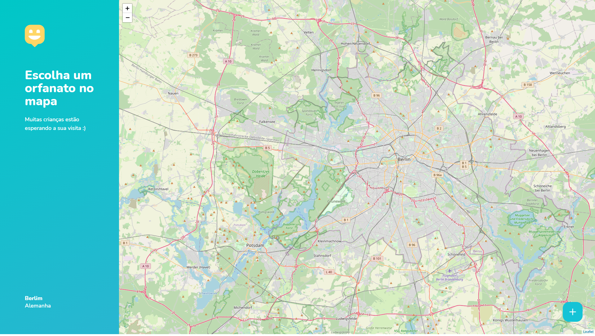
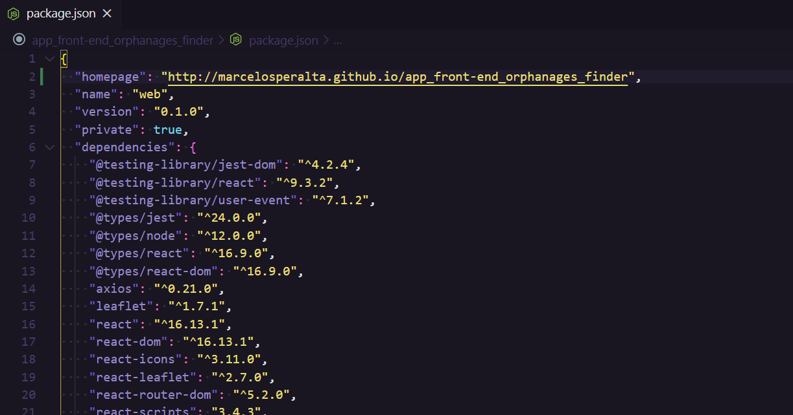

# "Happy" - Orphanage finder  

A platform to find orphanages to visit built with **[HTML](https://whatwg.org/)**, **[CSS](https://www.w3.org/Style/CSS/)**, **[JavaScript](https://developer.mozilla.org/en-US/docs/Web/JavaScript)**, **[TypeScript](https://www.typescriptlang.org/)**, **[React](https://reactjs.org/)**, and **[Node.js](https://nodejs.org/)**.  

###### _fullstack version:_ https://github.com/marcelosperalta/app_fullstack_orphanages_finder

<br>

<div align="center">
    
    
    &nbsp;
    
    &nbsp;
    &nbsp;
    
    &nbsp;
    
    &nbsp;
    
</div>

<br>

## :mortar_board: **_bootcamp:_**  

### [Rocketseat](https://rocketseat.com.br/)

#### [Next Level Week #3](https://nextlevelweek.com/)

*OmniStack* with [Diego Fernandes](https://github.com/diego3g)  


<br>

## :camera: **_screenshots:_**  

### :computer:  

  

  

## :fire: **_source code editor_**  

[Visual Studio Code](https://code.visualstudio.com/)  
<br>

## :wrench: **_front-end tools:_**  

[Figma](https://www.figma.com/)  

[React Icons](https://react-icons.github.io/react-icons/)  

[React Router](https://reactrouter.com/web/guides/quick-start)  

[Leaflet](https://leafletjs.com/)  

[React Leaflet](https://react-leaflet.js.org/)  

[OpenStreetMap](https://www.openstreetmap.org/)  

[mapbox](https://www.mapbox.com/)  

[Google Maps Platform](https://cloud.google.com/maps-platform)  
<br>

## :books: **_important topics:_**  

### front-end

[Representational state transfer (REST)](https://en.wikipedia.org/wiki/Representational_state_transfer)  

[JSON](https://www.json.org/)  

[Observer pattern](https://en.wikipedia.org/wiki/Observer_pattern#Uncoupled)  

[Single-page application (SPA)](https://en.wikipedia.org/wiki/Single-page_application)  

[Hot Reloading](https://reactnative.dev/blog/2016/03/24/introducing-hot-reloading.html#hot-reloading)  

[Fast Refresh](https://reactnative.dev/docs/fast-refresh)  

[React Hooks](https://reactjs.org/docs/hooks-intro.html)  

## :arrow_forward: **_start:_**  

### :full_moon: front-end ("web" folder)

:black_medium_small_square: **_creat react project adding typescript from terminal:_**  

```
yarn create react-app web --template typescript
```

or  

```
npx create-react-app web --template typescript
```

:black_medium_small_square: **_open the project from terminal:_**  

```
cd web
```

```
code .
```

:black_medium_small_square: **_run the project from terminal:_**  

```
yarn start
```

or  

```
npm start
```

:black_medium_small_square: **_install react icons:_**  

```
yarn add react-icons
```

or  

```
npm install react-icons
```

:black_medium_small_square: **_install react router:_**  

```
yarn add react-router-dom
yarn add @types/react-router-dom -D
```

or  

```
npm install react-router-dom
npm install @types/react-router-dom -D
```

:black_medium_small_square: **_install leaflet and react-leaflet:_**  

```
yarn add leaflet react-leaflet
yarn add @types/react-leaflet -D
```

### :octocat: How to deploy React App to [GitHub Pages](https://pages.github.com/)

:black_medium_small_square: **_install [GitHub Pages](https://www.npmjs.com/package/gh-pages) package as a dev-dependency:_**  

```
npm install gh-pages --save-dev
```

:black_medium_small_square: **_add to ```package.json``` file at the top level the property below:_**  

```
"homepage": "http://marcelosperalta.github.io/app_front-end_orphanages_finder",
```



:black_medium_small_square: **_in the existing scripts property we to need to add ```predeploy``` and ```deploy```:_**  

```
"scripts": {
    //...
    "predeploy": "npm run build",
    "deploy": "gh-pages -d build"
}
```


:black_medium_small_square: **_deploy it to GitHub Pages:_**  

```
npm run deploy
```

## :blue_book: **_references:_**  

[How to deploy React App to GitHub Pages](https://create-react-app.dev/docs/deployment/#step-1-deploying-your-react-project-to-vercel)  