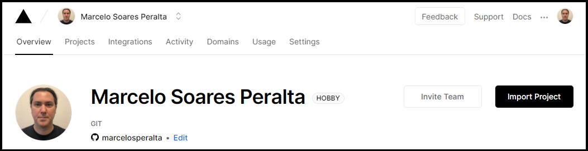

:link: https://app-front-end-orphanages-finder.vercel.app/

# "Happy" - Orphanage finder  

A platform to find orphanages to visit built with **[HTML](https://whatwg.org/)**, **[CSS](https://www.w3.org/Style/CSS/)**, **[JavaScript](https://developer.mozilla.org/en-US/docs/Web/JavaScript)**, **[TypeScript](https://www.typescriptlang.org/)**, **[React](https://reactjs.org/)**, and **[Node.js](https://nodejs.org/)**.  

<br>

<div align="center">
    
    
    &nbsp;
    
    &nbsp;
    &nbsp;
    
    &nbsp;
    
    &nbsp;
    
</div>

<br>

###### _fullstack version:_ https://github.com/marcelosperalta/app_fullstack_orphanages_finder

<br>

## :mortar_board: **_bootcamp:_**  

### [Rocketseat](https://rocketseat.com.br/)

#### [Next Level Week #3](https://nextlevelweek.com/)

*OmniStack* with [Diego Fernandes](https://github.com/diego3g)  


<br>

## :camera: **_screenshots:_**  

### :computer:  

  

  

## :fire: **_source code editor_**  

[Visual Studio Code](https://code.visualstudio.com/)  
<br>

## :wrench: **_front-end tools:_**  

[Figma](https://www.figma.com/)  

[React Icons](https://react-icons.github.io/react-icons/)  

[React Router](https://reactrouter.com/web/guides/quick-start)  

[Leaflet](https://leafletjs.com/)  

[React Leaflet](https://react-leaflet.js.org/)  

[OpenStreetMap](https://www.openstreetmap.org/)  

[mapbox](https://www.mapbox.com/)  

[Google Maps Platform](https://cloud.google.com/maps-platform)  
<br>

## :books: **_important topics:_**  

### front-end

[Representational state transfer (REST)](https://en.wikipedia.org/wiki/Representational_state_transfer)  

[JSON](https://www.json.org/)  

[Observer pattern](https://en.wikipedia.org/wiki/Observer_pattern#Uncoupled)  

[Single-page application (SPA)](https://en.wikipedia.org/wiki/Single-page_application)  

[Hot Reloading](https://reactnative.dev/blog/2016/03/24/introducing-hot-reloading.html#hot-reloading)  

[Fast Refresh](https://reactnative.dev/docs/fast-refresh)  

[React Hooks](https://reactjs.org/docs/hooks-intro.html)  

## :arrow_forward: **_Run:_**  

:black_medium_small_square: **_install dependencies from package.json:_**  

```
yarn install
```

:black_medium_small_square: **_run the project from terminal:_**  

```
yarn start
```

## :computer: How to deploy React App to [Vercel](https://vercel.com/)

:black_medium_small_square: **_create a ```build``` folder for the project:_**  

```
yarn build
```

:rotating_light: push the ```build``` folder to your GitHub repository  

:black_medium_small_square: **_import the GitHub project to [Vercel](https://vercel.com):_**  




